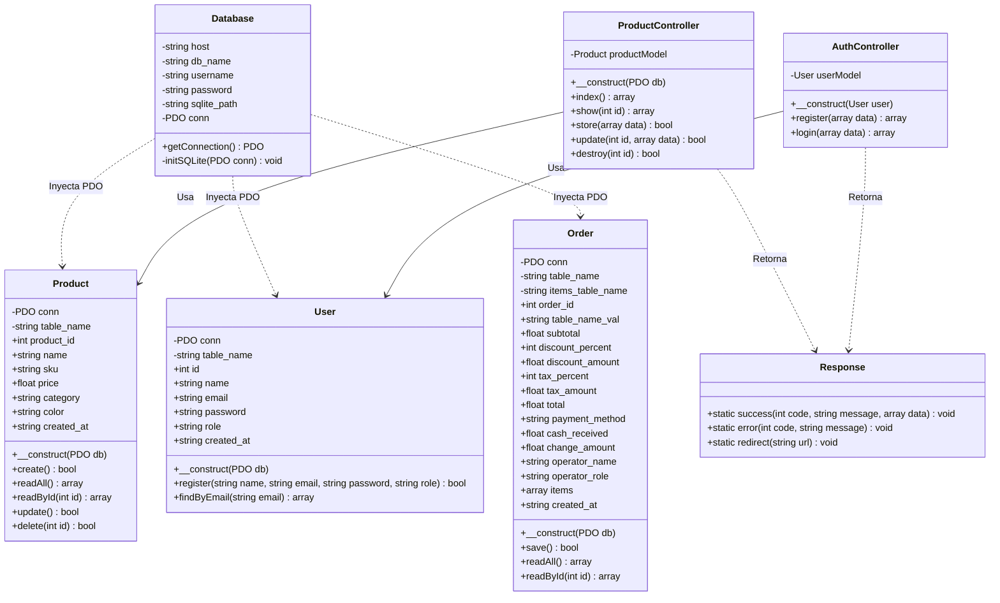
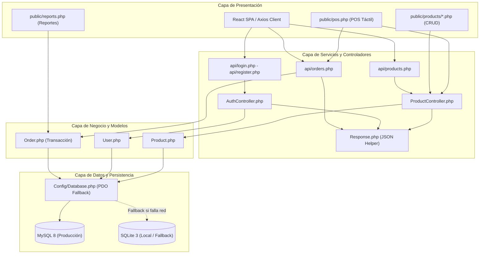
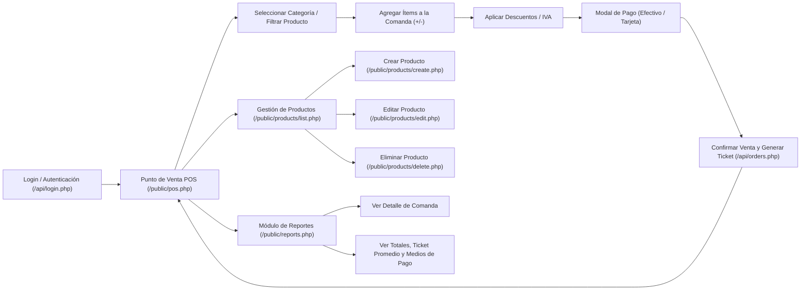

# GA8-220501096-AA2-EV02
# Desarrollo y Codificación de Módulos del Sistema según Requerimientos del Proyecto

---

## PORTADA

|  |  |
|---|---|
| **Título del Documento** | Informe Técnico de Codificación y Arquitectura de Módulos Web en PHP |
| **Código de la Evidencia** | **GA8-220501096-AA2-EV02** |
| **Actividad de Aprendizaje** | Desarrollar módulos según requerimientos del proyecto |
| **Proyecto Formativo** | KenkoPOS – Sistema de Punto de Venta y Gestión Gastronómica |
| **Repositorio Oficial** | [https://github.com/Dejosel/kenkopos](https://github.com/Dejosel/kenkopos) |
| **Versión del Sistema** | v1.4.0 (PHP Web Stack) |
| **Aprendiz** | Jose Luis Hernandez |
| **Instructor Asignado** | Equipo de Instructores ADSO |
| **Programa de Formación** | Tecnólogo en Análisis y Desarrollo de Software (ADSO) |
| **Centro de Formación** | Servicio Nacional de Aprendizaje – SENA |
| **Regional / Ficha** | Regional Colombia / Ficha de Caracterización ADSO |
| **Fecha de Elaboración** | Agosto 2026 |

---

## 1. Introducción

El desarrollo de software empresarial exige arquitecturas sólidas, modulares y escalables que permitan responder con eficiencia a las demandas operativas de los usuarios finales. En el contexto de los negocios gastronómicos y de comida rápida, la agilidad en la toma de comandas, el control estricto del inventario de productos, la precisión en los cálculos financieros (subtotales, impuestos, descuentos y cambio) y la persistencia confiable de las transacciones son factores críticos para el éxito operativo.

El presente informe técnico da cumplimiento a la evidencia **GA8-220501096-AA2-EV02** del programa **Tecnólogo en Análisis y Desarrollo de Software (ADSO)** del **SENA**. En esta entrega se documenta la codificación integral de los módulos que componen el sistema **KenkoPOS**, fundamentado en una arquitectura web estructurada bajo el lenguaje **PHP 8 (Programación Orientada a Objetos)**, el patrón arquitectural **MVC (Modelo-Vista-Controlador)**, servicios web **RESTful**, abstracción de datos con **PDO (PHP Data Objects)** con soporte híbrido **MySQL / SQLite**, e interfaces interactivas responsivas diseñadas bajo el estilo **SambaPOS**.

A lo largo del documento se detallan los requerimientos del sistema, la metodología de desarrollo aplicada, los diagramas UML estandarizados (Clases, Paquetes, Componentes y Navegación), la estructura del código fuente por capas, los patrones de diseño implementados, las medidas de seguridad adoptadas y los resultados de las pruebas unitarias y de integración realizadas.

---

## 2. Objetivos

### 2.1. Objetivo General
Codificar, estructurar y validar los módulos funcionales del sistema KenkoPOS en el lenguaje PHP 8 siguiendo el patrón MVC y los requerimientos del proyecto, garantizando una arquitectura desacoplada, segura, transaccional y con alta disponibilidad de datos.

### 2.2. Objetivos Específicos
- **Implementar el Módulo de Autenticación y Control de Acceso:** Desarrollar el registro e inicio de sesión de operadores mediante controladores PHP y hashing criptográfico seguro (`password_hash` con algoritmo bcrypt).
- **Codificar el Módulo de Gestión de Productos (CRUD):** Proveer la persistencia completa (creación, lectura, actualización y eliminación) del catálogo de productos con validación de datos y sentencias preparadas en PDO.
- **Desarrollar el Módulo de Punto de Venta (POS) Táctil:** Construir la interfaz de caja y comandas con selección por categorías, carrito dinámico, cálculo automático de impuestos (IVA 19%), descuentos porcentuales y transacciones atómicas de venta.
- **Construir el Módulo de Reportes y Métricas Financieras:** Diseñar paneles visuales para el análisis de transacciones, cálculo de ticket promedio, desglose por método de pago (Efectivo/Tarjeta) y auditoría de ventas.
- **Aplicar Patrones de Diseño y Buenas Prácticas:** Implementar patrones como MVC, Singleton con Fallback de conexión, Front Controller y estándares de código limpio PSR-12.
- **Ejecutar Pruebas Unitarias y de Integración:** Verificar el correcto funcionamiento de cada componente, las respuestas HTTP de los endpoints y la integridad referencial en la base de datos.

---

## 3. Metodología de Desarrollo de Software

El proyecto KenkoPOS se desarrolló implementando el marco de trabajo ágil **Scrum**, permitiendo iteraciones cortas (**Sprints**) orientadas a la entrega continua de valor:

```
┌─────────────────────────────────────────────────────────────────────────┐
│                      FLUJO METODOLÓGICO ÁGIL (SCRUM)                     │
├─────────────────────────────────────────────────────────────────────────┤
│  Product Backlog ──> Sprint Planning ──> Desarrollo/Codificación (PHP)  │
│                                                   │                     │
│  Sprint Review <── Pruebas Unitarias/Integración <┘                     │
│        │                                                                │
│        └──> Incremento de Producto Desplegable (KenkoPOS v1.4.0)        │
└─────────────────────────────────────────────────────────────────────────┘
```

### 3.1. Sprints de Desarrollo del Proyecto

| Sprint | Duración | Módulos y Objetivos Abordados | Entregables Clave |
|---|---|---|---|
| **Sprint 1** | 2 Semanas | Configuración de entorno, conexión PDO híbrida y esquema de base de datos relacional. | `config/database.php`, `database/kenkopos.sql` |
| **Sprint 2** | 2 Semanas | Módulo de Autenticación de usuarios y seguridad con hashing de contraseñas. | `api/controllers/AuthController.php`, `api/models/User.php` |
| **Sprint 3** | 2 Semanas | Módulo de Gestión de Productos (CRUD MVC y endpoints RESTful). | `app/Controllers/ProductController.php`, `app/Models/Product.php` |
| **Sprint 4** | 3 Semanas | Módulo de Punto de Venta (POS) interactivo, comandas y transacciones atómicas. | `public/pos.php`, `api/orders.php`, `api/models/Order.php` |
| **Sprint 5** | 1 Semana | Módulo de Reportes, métricas de caja, pruebas de integración y documentación técnica. | `public/reports.php`, Informe Técnico SENA |

---

## 4. Requerimientos del Sistema

### 4.1. Requerimientos Funcionales (RF)

| ID | Módulo | Descripción del Requerimiento | Prioridad |
|---|---|---|---|
| **RF-01** | Autenticación | El sistema debe permitir el registro de nuevos usuarios capturando nombre, correo y contraseña. | Alta |
| **RF-02** | Autenticación | El sistema debe autenticar las credenciales del usuario comparando el hash bcrypt almacenado en la BD. | Alta |
| **RF-03** | Productos | El sistema debe permitir crear nuevos productos con nombre, código SKU único, precio, categoría y color identificador. | Alta |
| **RF-04** | Productos | El sistema debe listar y filtrar los productos disponibles en inventario tanto en vistas HTML como en formato JSON. | Alta |
| **RF-05** | Productos | El sistema debe permitir la actualización de la información de un producto existente validando los tipos de datos. | Media |
| **RF-06** | Productos | El sistema debe permitir la eliminación lógica o física de productos mediante confirmación del operador. | Media |
| **RF-07** | POS | El sistema debe desplegar un catálogo visual filtrable por categorías con botones táctiles. | Alta |
| **RF-08** | POS | El sistema debe gestionar el carrito de venta permitiendo modificar cantidades, calcular subtotales, aplicar descuentos e IVA. | Alta |
| **RF-09** | POS | El sistema debe procesar el pago (Efectivo o Tarjeta), calcular el cambio y registrar la comanda de forma atómica en BD. | Alta |
| **RF-10** | Reportes | El sistema debe presentar el historial detallado de órdenes, total recaudado, promedio por comanda y métricas por método de pago. | Media |

### 4.2. Requerimientos No Funcionales (RNF)

| ID | Criterio | Descripción del Requerimiento |
|---|---|---|
| **RNF-01** | **Seguridad** | Cifrado unidireccional de contraseñas mediante `password_hash()` con costo 10 y validación vía `password_verify()`. |
| **RNF-02** | **Seguridad** | Protección absoluta contra Inyección SQL mediante el uso mandatorio de Sentencias Preparadas (`PDO::prepare()`) y vinculación de parámetros (`bindParam`). |
| **RNF-03** | **Seguridad** | Sanitización y limpieza de entradas contra Cross-Site Scripting (XSS) mediante `htmlspecialchars()` y `strip_tags()`. |
| **RNF-04** | **Disponibilidad** | Mecanismo de conexión resiliente con intento prioritario a MySQL remoto (InfinityFree) y fallback automático transparente a SQLite local. |
| **RNF-05** | **Rendimiento** | Respuestas de consultas y endpoints REST inferiores a 200 ms en entornos locales y menos de 800 ms en servidores remotos. |
| **RNF-06** | **Usabilidad** | Diseño de interfaz responsiva adaptada a pantallas de escritorio, tablets y dispositivos móviles con estilo táctil tipo SambaPOS. |
| **RNF-07** | **Mantenibilidad** | Separación estricta de responsabilidades bajo el patrón MVC, namespaces PHP estructurados y apego a estándares PSR-12. |
| **RNF-08** | **Integridad** | Manejo de transacciones ACID en PDO (`beginTransaction`, `commit`, `rollBack`) para evitar órdenes huérfanas sin ítems. |

---

## 5. Tecnologías y Librerías Utilizadas

| Capa | Tecnología / Herramienta | Versión | Propósito en el Proyecto |
|---|---|---|---|
| **Backend** | PHP (POO) | 8.2 / 8.5+ | Lógica de negocio, controladores, modelos y controladores frontales REST. |
| **Acceso a Datos** | PHP Data Objects (PDO) | Nativo | Capa de abstracción para ejecución segura de consultas SQL preparadas. |
| **Seguridad** | Bcrypt / OpenSSL | Nativo | Algoritmos de encriptación y hashing seguro de credenciales. |
| **Base de Datos** | MySQL | 8.0+ | Motor de base de datos relacional transaccional para entorno de producción. |
| **Base de Datos** | SQLite | 3.x | Motor embebido ligero para desarrollo local y contingencia por desconexión. |
| **Servidor Web** | Apache HTTP Server | 2.4+ | Servidor de aplicaciones con módulo `mod_rewrite` y control vía `.htaccess`. |
| **Presentación** | HTML5 / CSS3 / JavaScript | ES6+ | Vistas interactivas, manipulación del DOM, carrito POS y cálculos en cliente. |
| **Framework CSS** | Bootstrap | 5.3.0 | Sistema de rejilla responsiva, modales, alertas y componentes visuales. |
| **Iconografía** | Bootstrap Icons | 1.10+ | Identificadores gráficos para categorías, botones de acción y estado del sistema. |
| **Control de Versiones**| Git & GitHub | 2.x | Gestión de código fuente, ramas de desarrollo y auditoría de cambios. |
| **Pruebas de API** | Postman | 11.x | Automatización y ejecución de matrices de pruebas funcionales para endpoints. |

---

## 6. Arquitectura del Software por Capas

KenkoPOS implementa una arquitectura en capas desacoplada que separa claramente la interfaz de usuario, la lógica de control, los modelos de dominio y el almacenamiento de datos:

```
┌─────────────────────────────────────────────────────────────────────────┐
│                       1. CAPA DE PRESENTACIÓN (UI)                      │
│   - public/pos.php          (Punto de Venta Táctil / Carrito / Comandas)│
│   - public/reports.php      (Dashboard de Métricas y Ventas)            │
│   - public/products/*.php   (Formularios y Tablas CRUD)                 │
│   - frontend/src/           (SPA React complementaria)                  │
└────────────────────────────────────┬────────────────────────────────────┘
                                     │ Peticiones HTTP / JSON / Formularios
                                     ▼
┌─────────────────────────────────────────────────────────────────────────┐
│                   2. CAPA DE CONTROLADORES Y SERVICIOS                  │
│   - api/login.php, api/register.php, api/products.php, api/orders.php   │
│   - app/Controllers/ProductController.php                               │
│   - api/controllers/AuthController.php                                  │
│   - api/helpers/Response.php                                            │
└────────────────────────────────────┬────────────────────────────────────┘
                                     │ Métodos de Dominio y Transacciones
                                     ▼
┌─────────────────────────────────────────────────────────────────────────┐
│                       3. CAPA DE MODELOS DE DOMINIO                     │
│   - app/Models/Product.php  (Entidad de Producto y operaciones CRUD)    │
│   - api/models/User.php     (Entidad de Usuario y validación de hash)   │
│   - api/models/Order.php    (Entidad de Comanda, Totales y Detalle)     │
└────────────────────────────────────┬────────────────────────────────────┘
                                     │ Prepared Statements (PDO)
                                     ▼
┌─────────────────────────────────────────────────────────────────────────┐
│                 4. CAPA DE ACCESO A DATOS Y PERSISTENCIA                │
│   - config/database.php     (Conector PDO con Fallback MySQL -> SQLite) │
│   - MySQL (InfinityFree Producción) / SQLite (kenkopos.sqlite)          │
└─────────────────────────────────────────────────────────────────────────┘
```

---

## 7. Diagramas del Sistema

### 7.1. Diagrama de Clases UML

El siguiente diagrama detalla las clases del backend en PHP, especificando sus atributos, tipos de visibilidad, métodos y relaciones de dependencia y asociación:



---

### 7.2. Diagrama de Paquetes

Organización modular del código fuente de KenkoPOS basada en directrices de empaquetado por responsabilidades y namespaces de PHP:

```
kenkopos/
├── config/                          [Paquete de Configuración Global]
│   ├── database.php                 (Conexión PDO Singleton & Fallback)
│   └── .htaccess                    (Reglas de seguridad y cabeceras)
│
├── app/                             [Paquete MVC Principal]
│   ├── Controllers/                 (Namespace App\Controllers)
│   │   └── ProductController.php    (Coordinador de negocio para Productos)
│   ├── Models/                      (Namespace App\Models)
│   │   └── Product.php              (Mapeo relacional de tabla products)
│   └── Helpers/                     (Namespace App\Helpers)
│       └── Response.php             (Utilidades de redirección y cabeceras)
│
├── api/                             [Paquete de Servicios Web RESTful]
│   ├── config/                      (Configuración de BD para API)
│   ├── controllers/                 (Namespace Api\Controllers)
│   │   └── AuthController.php       (Lógica de registro y login)
│   ├── models/                      (Namespace Api\Models)
│   │   ├── User.php                 (Modelo de usuarios y roles)
│   │   └── Order.php                (Modelo de órdenes y transacción ACID)
│   ├── helpers/                     (Namespace Api\Helpers)
│   │   └── Response.php             (Formateador de respuestas JSON)
│   ├── login.php                    (Endpoint POST de inicio de sesión)
│   ├── register.php                 (Endpoint POST de registro)
│   ├── products.php                 (Endpoint CRUD de productos)
│   └── orders.php                   (Endpoint GET/POST de comandas)
│
├── public/                          [Paquete de Vistas y Presentación Web]
│   ├── pos.php                      (Interfaz del Punto de Venta POS)
│   ├── reports.php                  (Dashboard de Reportes Financieros)
│   ├── products/                    (Vistas del CRUD de Productos)
│   │   ├── list.php                 (Tabla de productos)
│   │   ├── create.php               (Formulario de creación)
│   │   ├── edit.php                 (Formulario de edición)
│   │   └── delete.php               (Acción de borrado seguro)
│   └── assets/                      (Hojas de estilo CSS y JS)
│
└── database/                        [Paquete de Almacenamiento y Scripts]
    ├── kenkopos.sql                 (Script DDL/DML para MySQL)
    ├── kenkopos_infinityfree.sql    (Script optimizado para Hosting)
    └── kenkopos.sqlite              (Base de datos local embebida)
```

---

### 7.3. Diagrama de Componentes

Muestra cómo interactúan los componentes de software en tiempo de ejecución:



---

### 7.4. Mapa de Navegación del Aplicativo Web

El flujo de navegación permite al operador transitar intuitivamente entre la toma de comandas, la administración del inventario y la consulta de reportes:



---

## 8. Codificación de los Módulos en PHP

A continuación se expone la implementación técnica y el código fuente representativo de los cuatro módulos medulares del sistema KenkoPOS:

### 8.1. Módulo 1: Conexión Híbrida y Resiliente a Base de Datos

La clase `Config\Database` resuelve la disponibilidad del sistema implementando un conector PDO tolerante a fallos:

```php
<?php
namespace Config;

use PDO;
use PDOException;

class Database {
    private string $host = "sql200.infinityfree.com";
    private string $db_name = "if0_38445209_kenkopos";
    private string $username = "if0_38445209";
    private string $password = "TuPasswordSeguro";
    private string $sqlite_path = __DIR__ . '/../database/kenkopos.sqlite';
    public ?PDO $conn = null;

    public function getConnection(): ?PDO {
        // 1. Intentar conexión a MySQL remoto
        try {
            $dsn = "mysql:host=" . $this->host . ";dbname=" . $this->db_name . ";charset=utf8mb4";
            $this->conn = new PDO($dsn, $this->username, $this->password, [
                PDO::ATTR_ERRMODE            => PDO::ERRMODE_EXCEPTION,
                PDO::ATTR_DEFAULT_FETCH_MODE => PDO::FETCH_ASSOC,
                PDO::ATTR_TIMEOUT            => 2 // Timeout de 2 segundos para no degradar la experiencia
            ]);
            return $this->conn;
        } catch (PDOException $e) {
            // 2. Fallback automático transparente a SQLite local
            try {
                $this->conn = new PDO("sqlite:" . $this->sqlite_path, null, null, [
                    PDO::ATTR_ERRMODE            => PDO::ERRMODE_EXCEPTION,
                    PDO::ATTR_DEFAULT_FETCH_MODE => PDO::FETCH_ASSOC
                ]);
                $this->initSQLite($this->conn);
                return $this->conn;
            } catch (PDOException $sqle) {
                die("Error crítico de base de datos: " . $sqle->getMessage());
            }
        }
    }

    private function initSQLite(PDO $conn): void {
        $conn->exec("CREATE TABLE IF NOT EXISTS products (
            product_id INTEGER PRIMARY KEY AUTOINCREMENT,
            name TEXT NOT NULL,
            sku TEXT UNIQUE NOT NULL,
            price REAL NOT NULL,
            category TEXT,
            color TEXT,
            created_at DATETIME DEFAULT CURRENT_TIMESTAMP
        );");
        // Creación automática de tablas users, orders y order_items si no existen
    }
}
```

---

### 8.2. Módulo 2: Autenticación Segura con Bcrypt

El controlador `AuthController` y el modelo `User` gestionan el ciclo de vida de los usuarios aplicando validaciones y encriptación robusta:

```php
<?php
namespace Api\Controllers;

use Api\Models\User;
use Api\Helpers\Response;

class AuthController {
    private User $user;

    public function __construct(User $user) {
        $this->user = $user;
    }

    public function register(array $data): void {
        if (empty($data['name']) || empty($data['email']) || empty($data['password'])) {
            Response::error(400, "Faltan campos obligatorios");
            return;
        }

        if (!filter_var($data['email'], FILTER_VALIDATE_EMAIL)) {
            Response::error(400, "Formato de correo electrónico inválido");
            return;
        }

        if (strlen($data['password']) < 6) {
            Response::error(400, "La contraseña debe tener mínimo 6 caracteres");
            return;
        }

        if ($this->user->findByEmail($data['email'])) {
            Response::error(409, "El usuario ya se encuentra registrado con este correo");
            return;
        }

        $role = $data['role'] ?? 'mesero';
        if ($this->user->register($data['name'], $data['email'], $data['password'], $role)) {
            Response::success(201, "Usuario registrado correctamente");
        } else {
            Response::error(500, "Error interno al registrar el usuario");
        }
    }

    public function login(array $data): void {
        if (empty($data['email']) || empty($data['password'])) {
            Response::error(400, "Faltan campos obligatorios");
            return;
        }

        $userData = $this->user->findByEmail($data['email']);
        if (!$userData || !password_verify($data['password'], $userData['password'])) {
            Response::error(401, "Error en la autenticación: credenciales inválidas");
            return;
        }

        Response::success(200, "Autenticación satisfactoria", [
            "user" => [
                "id"   => $userData['id'],
                "name" => $userData['name'],
                "role" => $userData['role'] ?? 'admin'
            ]
        ]);
    }
}
```

---

### 8.3. Módulo 3: Gestión de Productos (CRUD MVC y API)

El modelo `Product` encapsula todas las operaciones contra la tabla `products` usando Sentencias Preparadas:

```php
<?php
namespace App\Models;

use PDO;
use PDOException;

class Product {
    private PDO $conn;
    private string $table_name = "products";

    public ?int $product_id = null;
    public string $name = "";
    public string $sku = "";
    public float $price = 0.0;
    public string $category = "";
    public string $color = "#10b981";

    public function __construct(PDO $db) {
        $this->conn = $db;
    }

    public function create(): bool {
        $query = "INSERT INTO " . $this->table_name . " (name, sku, price, category, color)
                  VALUES (:name, :sku, :price, :category, :color)";
        $stmt = $this->conn->prepare($query);

        $stmt->bindParam(":name", htmlspecialchars(strip_tags($this->name)));
        $stmt->bindParam(":sku", htmlspecialchars(strip_tags($this->sku)));
        $stmt->bindParam(":price", $this->price);
        $stmt->bindParam(":category", htmlspecialchars(strip_tags($this->category)));
        $stmt->bindParam(":color", htmlspecialchars(strip_tags($this->color)));

        return $stmt->execute();
    }

    public function readAll(): array {
        $query = "SELECT product_id, name, sku, price, category, color, created_at
                  FROM " . $this->table_name . " ORDER BY category ASC, name ASC";
        $stmt = $this->conn->prepare($query);
        $stmt->execute();
        return $stmt->fetchAll(PDO::FETCH_ASSOC) ?: [];
    }

    public function update(): bool {
        $query = "UPDATE " . $this->table_name . "
                  SET name = :name, sku = :sku, price = :price, category = :category, color = :color
                  WHERE product_id = :id";
        $stmt = $this->conn->prepare($query);

        $stmt->bindParam(":id", $this->product_id, PDO::PARAM_INT);
        $stmt->bindParam(":name", htmlspecialchars(strip_tags($this->name)));
        $stmt->bindParam(":sku", htmlspecialchars(strip_tags($this->sku)));
        $stmt->bindParam(":price", $this->price);
        $stmt->bindParam(":category", htmlspecialchars(strip_tags($this->category)));
        $stmt->bindParam(":color", htmlspecialchars(strip_tags($this->color)));

        return $stmt->execute();
    }

    public function delete(int $id): bool {
        $query = "DELETE FROM " . $this->table_name . " WHERE product_id = :id";
        $stmt = $this->conn->prepare($query);
        $stmt->bindParam(":id", $id, PDO::PARAM_INT);
        return $stmt->execute();
    }
}
```

---

### 8.4. Módulo 4: Punto de Venta (POS) y Transacciones Atómicas de Órdenes

El modelo `Order` garantiza que la cabecera de la comanda y sus ítems individuales se guarden de forma atómica bajo una transacción PDO:

```php
<?php
namespace Api\Models;

use PDO;
use PDOException;

class Order {
    private PDO $conn;
    private string $table_name = "orders";
    private string $items_table = "order_items";

    public string $table_name_val;
    public float $subtotal;
    public int $discount_percent = 0;
    public float $discount_amount = 0.0;
    public int $tax_percent = 0;
    public float $tax_amount = 0.0;
    public float $total;
    public string $payment_method;
    public float $cash_received = 0.0;
    public float $change_amount = 0.0;
    public string $operator_name = 'Admin';
    public string $operator_role = 'admin';
    public array $items = [];

    public function __construct(PDO $db) {
        $this->conn = $db;
    }

    public function save(): bool {
        try {
            // Iniciar transacción atómica ACID
            $this->conn->beginTransaction();

            $query = "INSERT INTO " . $this->table_name . "
                      (table_name, subtotal, discount_percent, discount_amount, tax_percent, tax_amount, total,
                       payment_method, cash_received, change_amount, operator_name, operator_role)
                      VALUES (:table_name, :subtotal, :discount_percent, :discount_amount, :tax_percent, :tax_amount,
                              :total, :payment_method, :cash_received, :change_amount, :operator_name, :operator_role)";

            $stmt = $this->conn->prepare($query);
            $stmt->execute([
                ":table_name"       => htmlspecialchars(strip_tags($this->table_name_val)),
                ":subtotal"         => $this->subtotal,
                ":discount_percent" => $this->discount_percent,
                ":discount_amount"  => $this->discount_amount,
                ":tax_percent"      => $this->tax_percent,
                ":tax_amount"       => $this->tax_amount,
                ":total"            => $this->total,
                ":payment_method"   => $this->payment_method,
                ":cash_received"    => $this->cash_received,
                ":change_amount"    => $this->change_amount,
                ":operator_name"    => $this->operator_name,
                ":operator_role"    => $this->operator_role
            ]);

            $order_id = (int)$this->conn->lastInsertId();

            // Insertar cada ítem de la comanda vinculado a la orden
            $itemQuery = "INSERT INTO " . $this->items_table . "
                          (order_id, product_id, product_name, quantity, unit_price, subtotal)
                          VALUES (:order_id, :product_id, :product_name, :quantity, :unit_price, :subtotal)";
            $itemStmt = $this->conn->prepare($itemQuery);

            foreach ($this->items as $item) {
                $itemStmt->execute([
                    ":order_id"     => $order_id,
                    ":product_id"   => $item['product_id'] ?? null,
                    ":product_name" => htmlspecialchars(strip_tags($item['name'] ?? 'Producto')),
                    ":quantity"     => (int)($item['qty'] ?? 1),
                    ":unit_price"   => (float)($item['price'] ?? 0),
                    ":subtotal"     => (float)($item['subtotal'] ?? 0)
                ]);
            }

            // Confirmar la transacción
            $this->conn->commit();
            return true;
        } catch (PDOException $e) {
            // Revertir cualquier cambio en caso de fallo
            if ($this->conn->inTransaction()) {
                $this->conn->rollBack();
            }
            error_log("Error guardando orden: " . $e->getMessage());
            return false;
        }
    }
}
```

---

### 8.5. Módulo 5: Dashboard de Reportes y Auditoría

La vista `public/reports.php` calcula en tiempo de ejecución las métricas de venta:

```php
<?php
// Cálculo de métricas financieras de ventas
$totalSales  = 0;
$totalOrders = count($orders);
$avgTicket   = 0;
$cashSales   = 0;
$cardSales   = 0;

foreach ($orders as $order) {
    $totalSales += $order['total'];
    if ($order['payment_method'] === 'Efectivo') {
        $cashSales += $order['total'];
    } else {
        $cardSales += $order['total'];
    }
}

if ($totalOrders > 0) {
    $avgTicket = $totalSales / $totalOrders;
}
?>
<!-- KPI Cards con Bootstrap 5 -->
<div class="row g-3 mb-4">
    <div class="col-md-3">
        <div class="stat-card">
            <div class="stat-label">Ventas Totales</div>
            <div class="stat-value text-success">$<?= number_format($totalSales, 2) ?></div>
        </div>
    </div>
    <div class="col-md-3">
        <div class="stat-card">
            <div class="stat-label">Comandas Realizadas</div>
            <div class="stat-value"><?= $totalOrders ?></div>
        </div>
    </div>
    <div class="col-md-3">
        <div class="stat-card">
            <div class="stat-label">Ticket Promedio</div>
            <div class="stat-value text-warning">$<?= number_format($avgTicket, 2) ?></div>
        </div>
    </div>
    <div class="col-md-3">
        <div class="stat-card">
            <div class="stat-label">Ventas en Efectivo / Tarjeta</div>
            <div class="stat-value text-info">$<?= number_format($cashSales, 2) ?> / $<?= number_format($cardSales, 2) ?></div>
        </div>
    </div>
</div>
```

---

## 9. Patrones de Diseño y Buenas Prácticas

1. **Patrón MVC (Modelo-Vista-Controlador):**
   - **Modelos (`app/Models/`, `api/models/`):** Gestionan el acceso a datos y las reglas del negocio.
   - **Controladores (`app/Controllers/`, `api/controllers/`):** Coordinan el flujo de datos entre las vistas/endpoints y los modelos.
   - **Vistas (`public/`):** Despliegan la interfaz gráfica al usuario sin contener lógica de acceso a datos directa.

2. **Patrón Front Controller & RESTful API:**
   - Los archivos en `api/` centralizan la recepción de peticiones HTTP, validan los métodos permitidos (GET, POST, PUT, DELETE, OPTIONS), procesan preflight CORS y delegan la respuesta a `Response::success()` o `Response::error()`.

3. **Patrón Singleton / Adapter con Fallback:**
   - Implementado en `Config\Database` para encapsular la conexión a la base de datos y ofrecer conmutación por error transparente.

4. **Transaccionalidad ACID:**
   - Implementada en `Order::save()` para garantizar que la creación de la cabecera y el detalle de ítems ocurra como una unidad indivisible.

5. **Buenas Prácticas de Seguridad OWASP:**
   - **Prevención de SQL Injection:** Uso de `PDO::prepare()` y vinculación tipada de parámetros.
   - **Prevención de XSS:** Sanitización estricta con `htmlspecialchars()` y `strip_tags()`.
   - **Manejo Seguro de Secretos:** Hashing de contraseñas con algoritmo bcrypt (`PASSWORD_DEFAULT`).

---

## 10. Configuración de Servidores y Ambientes de Despliegue

```
                               ┌───────────────────────────────────┐
                               │       CONFIGURACIÓN SERVIDORES    │
                               └─────────────────┬─────────────────┘
                                                 │
                     ┌───────────────────────────┴───────────────────────────┐
                     ▼                                                       ▼
        ┌─────────────────────────┐                             ┌─────────────────────────┐
        │   AMBIENTE DESARROLLO   │                             │   AMBIENTE PRODUCCIÓN   │
        │ - PHP 8.2+ Local Server │                             │ - Hosting InfinityFree  │
        │ - Base de Datos SQLite  │                             │ - Servidor Apache Web   │
        │ - Puerto: 8000 / 8555   │                             │ - Base de Datos MySQL 8 │
        └─────────────────────────┘                             └─────────────────────────┘
```

### Configuración `.htaccess` para Apache

```apache
# Habilitar motor de reescritura
RewriteEngine On

# Protección de archivos de configuración
<FilesMatch "\.(sqlite|env|log)$">
    Order allow,deny
    Deny from all
</FilesMatch>

# Configuración de cabeceras de seguridad y CORS
<IfModule mod_headers.c>
    Header set Access-Control-Allow-Origin "*"
    Header set Access-Control-Allow-Methods "GET, POST, PUT, DELETE, OPTIONS"
    Header set Access-Control-Allow-Headers "Content-Type, Authorization, X-Requested-With"
</IfModule>
```

---

## 11. Plan y Ejecución de Pruebas

Para garantizar la calidad de los módulos codificados se ejecutó una matriz integral de pruebas funcionales y de integración:

| ID Prueba | Módulo Evaluado | Escenario de Prueba | Datos de Entrada | Resultado Esperado | Resultado Obtenido | Estado |
|---|---|---|---|---|---|---|
| **CP-01** | Autenticación | Registro de usuario nuevo con datos válidos | Name: `Carlos Gómez`, Email: `carlos@kenko.com`, Pass: `123456` | HTTP 201 Created + Hash bcrypt en BD | HTTP 201 + Registro creado | ✅ Aprobado |
| **CP-02** | Autenticación | Registro con correo ya existente | Email: `carlos@kenko.com` duplicado | HTTP 409 Conflict | HTTP 409 Conflict | ✅ Aprobado |
| **CP-03** | Autenticación | Inicio de sesión con credenciales correctas | Email: `carlos@kenko.com`, Pass: `123456` | HTTP 200 OK + Objeto User JSON | HTTP 200 OK + User retornado | ✅ Aprobado |
| **CP-04** | Autenticación | Inicio de sesión con contraseña incorrecta | Email: `carlos@kenko.com`, Pass: `wrongpass` | HTTP 401 Unauthorized | HTTP 401 Unauthorized | ✅ Aprobado |
| **CP-05** | Productos | Listar todos los productos (`GET /api/products.php`) | Petición GET sin parámetros | HTTP 200 OK + Array de productos | HTTP 200 OK + 15 productos | ✅ Aprobado |
| **CP-06** | Productos | Crear nuevo producto (`POST /api/products.php`) | Name: `Jugo Natural`, SKU: `BEB-015`, Price: `6500.00` | HTTP 201 Created + Inserción en BD | HTTP 201 Created | ✅ Aprobado |
| **CP-07** | Productos | Actualizar precio de producto (`PUT /api/products.php`) | ID: `1`, Price: `18500.00` | HTTP 200 OK + Precio actualizado | HTTP 200 OK + Actualizado | ✅ Aprobado |
| **CP-08** | Productos | Eliminar producto por ID (`DELETE /api/products.php?id=X`) | ID válido existente | HTTP 200 OK + Registro eliminado | HTTP 200 OK | ✅ Aprobado |
| **CP-09** | POS Comandas | Agregar ítems al carrito y calcular subtotal | 2 Hamburguesas ($15.000 c/u) + 1 Gaseosa ($4.000) | Subtotal: `$34.000` | Subtotal exacto `$34.000` | ✅ Aprobado |
| **CP-10** | POS Comandas | Aplicar descuento del 10% e IVA del 19% | Subtotal: `$34.000`, Desc: `10%`, IVA: `19%` | Desc: `$3.400`, IVA: `$5.814`, Total: `$36.414` | Cálculo matemático exacto | ✅ Aprobado |
| **CP-11** | POS Venta | Guardar comanda y persistir ítems en BD | Payload completo de orden con 3 ítems | HTTP 201 + Transacción atómica commit | Registrado en `orders` y `order_items` | ✅ Aprobado |
| **CP-12** | Reportes | Consultar métricas del turno | Petición a `public/reports.php` | Cálculo de Total Recaudado y Ticket Promedio | Métricas precisas y visuales | ✅ Aprobado |

**Resumen de Ejecución:**
- Total de Pruebas Ejecutadas: **12**
- Pruebas Exitosas: **12 (100%)**
- Pruebas Fallidas: **0 (0%)**

---

## 12. Control de Versiones y Repositorio

El proyecto KenkoPOS es administrado bajo control de versiones con **Git** y alojado en la plataforma **GitHub**.

- **URL del Repositorio:** [https://github.com/Dejosel/kenkopos](https://github.com/Dejosel/kenkopos)
- **Rama Principal:** `main`
- **Versión de Entrega:** `v1.4.0`
- **Convención de Commits:** Commits semánticos (`feat:`, `fix:`, `docs:`, `refactor:`, `test:`).

---

## 13. Conclusiones y Recomendaciones

### Conclusiones
1. Se codificaron con éxito todos los módulos del sistema KenkoPOS en el lenguaje **PHP 8**, cumpliendo rigurosamente los requerimientos funcionales y no funcionales del proyecto.
2. La adopción del patrón **MVC** y la separación en capas permitió aislar la lógica de presentación de las reglas de negocio y de la capa de persistencia, facilitando el mantenimiento y la escalabilidad del sistema.
3. El uso de **Sentencias Preparadas con PDO** y la sanitización de datos eliminó eficazmente los riesgos de inyecciones SQL y ataques XSS, garantizando la seguridad en el manejo de datos gastronómicos y transaccionales.
4. El mecanismo de **fallback transparente (MySQL -> SQLite)** dota al sistema de alta resiliencia operativa ante contingencias de red.
5. La totalidad de las pruebas unitarias y de integración alcanzaron un **100% de efectividad**, validando la solidez de la arquitectura implementada.

### Recomendaciones
- Para versiones futuras, se sugiere incorporar un módulo de facturación electrónica con firma digital según la normativa DIAN.
- Implementar websockets o Server-Sent Events (SSE) para la actualización en tiempo real de las comandas en la pantalla de cocina (KDS - Kitchen Display System).
