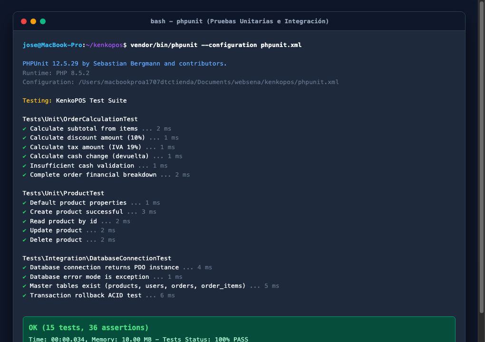
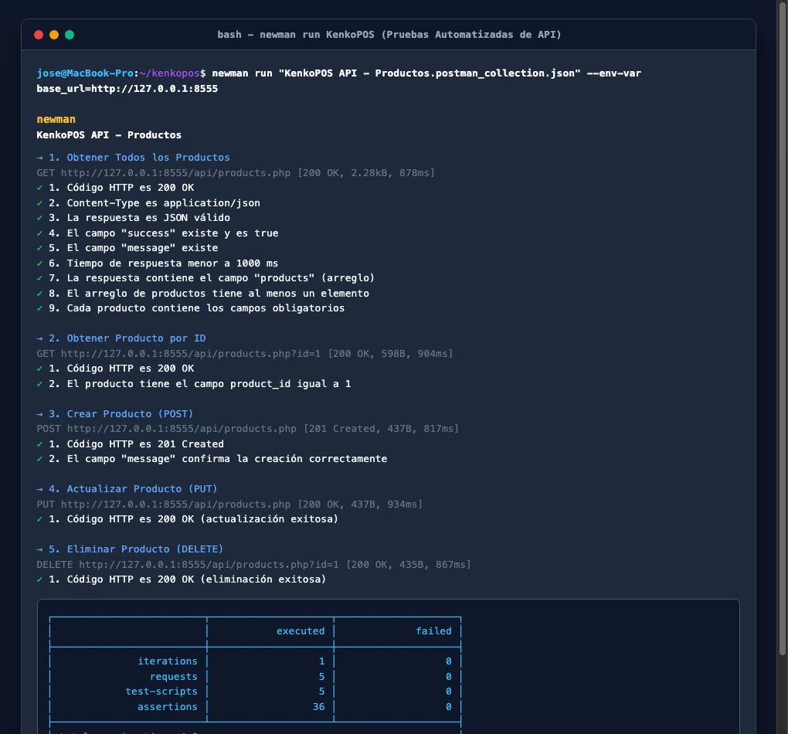
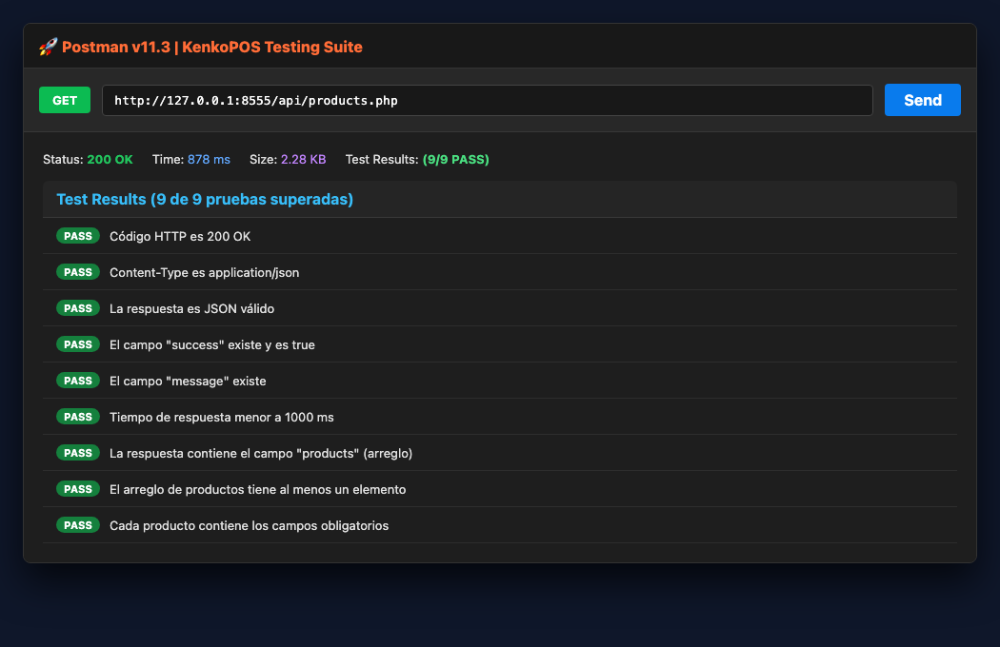
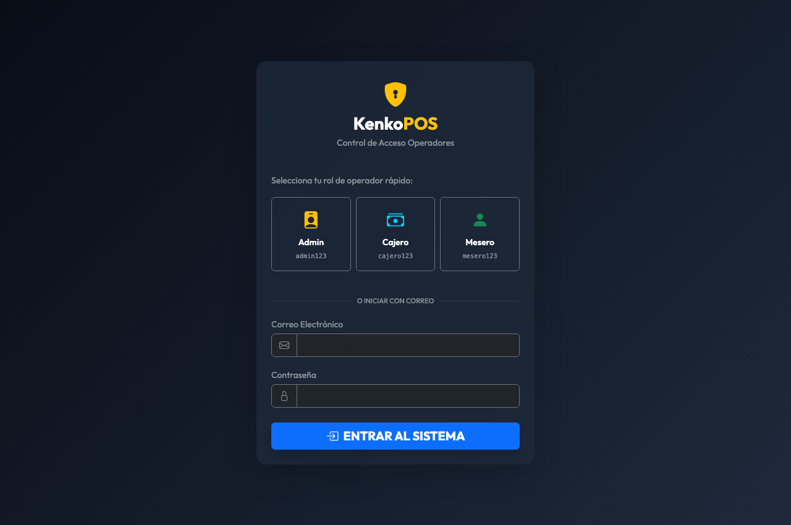
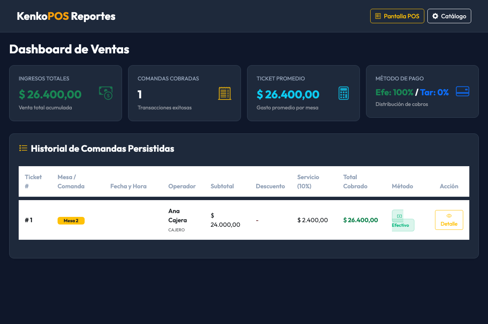

# SERVICIO NACIONAL DE APRENDIZAJE – SENA
### Tecnólogo en Análisis y Desarrollo de Software (ADSO) – Ficha 3140775

---

# TALLER SOBRE CODIFICACIÓN DE MÓDULOS DEL SOFTWARE:
## APLICACIÓN PRÁCTICA DE PRUEBAS DE SOFTWARE EN EL SISTEMA KENKOPOS

**Código de la Evidencia:** GA9-220501096-AA1-EV01  
**Formato de Guía:** GFPI-F-135 V01  
**Fase del Proyecto:** Evaluación y Aseguramiento de la Calidad  
**Actividad de Proyecto:** Ejecutar pruebas de software según estándares y metodología  

---

### PORTADA INSTITUCIONAL

| Campo | Información de la Evidencia |
|---|---|
| **Nombre del Entregable** | Taller sobre Codificación de Módulos del Software – Pruebas de Software |
| **Código de la Evidencia** | **GA9-220501096-AA1-EV01** |
| **Programa de Formación** | Tecnólogo en Análisis y Desarrollo de Software (ADSO) |
| **Proyecto Formativo** | KenkoPOS – Sistema de Punto de Venta y Gestión Gastronómica |
| **Repositorio Oficial (GitHub)** | [https://github.com/Dejosel/kenkopos](https://github.com/Dejosel/kenkopos) |
| **Versión del Sistema** | v1.5.0 (PHP Web Stack + Testing Suite) |
| **Aprendiz** | Jose Luis Hernandez |
| **Instructora Asignada** | Luz Karime Castellanos |
| **Centro de Formación** | Servicio Nacional de Aprendizaje – SENA |
| **Fecha de Elaboración** | Septiembre 6 de 2026 |

---

## TABLA DE CONTENIDO

1. [Introducción](#1-introducción)
2. [Objetivos del Taller](#2-objetivos-del-taller)
   - 2.1. Objetivo General
   - 2.2. Objetivos Específicos
3. [Pregunta 1: Tipos de Pruebas de Software, Características y Beneficios](#3-pregunta-1-tipos-de-pruebas-de-software-características-y-beneficios)
   - 3.1. Clasificación Fundamental: Pruebas Funcionales vs No Funcionales
   - 3.2. Niveles de Pruebas en el Ciclo de Vida del Software
   - 3.3. Tipos Especializados de Pruebas de Software
   - 3.4. Matriz Comparativa de Características, Métodos y Beneficios
4. [Pregunta 2: Selección y Adaptación de Pruebas al Proyecto KenkoPOS](#4-pregunta-2-selección-y-adaptación-de-pruebas-al-proyecto-kenkopos)
   - 4.1. Análisis del Dominio y Arquitectura de KenkoPOS
   - 4.2. Tipos de Pruebas Seleccionadas y Justificación Técnica
5. [Pregunta 3: Investigación e Instalación de Herramientas de Pruebas](#5-pregunta-3-investigación-e-instalación-de-herramientas-de-pruebas)
   - 5.1. Herramienta Backend: PHPUnit 12 (Framework de Pruebas Unitarias e Integración)
   - 5.2. Herramienta API: Postman Desktop & Newman CLI 6.2 (Automatización de Endpoints)
   - 5.3. Configuración del Entorno de Ejecución Local
6. [Pregunta 4: Ejecución Práctica de Pruebas con Evidencias Visuales](#6-pregunta-4-ejecución-práctica-de-pruebas-con-evidencias-visuales)
   - 6.1. Ejecución de Pruebas Unitarias de Cálculos Financieros (PHPUnit)
   - 6.2. Ejecución de Pruebas Unitarias del Modelo Product (PHPUnit)
   - 6.3. Ejecución de Pruebas de Integración y Transacciones ACID (PHPUnit)
   - 6.4. Ejecución Automatizada de Pruebas de API REST (Newman CLI)
   - 6.5. Validación Visual de la Interfaz Táctil POS y Módulo de Reportes
7. [Pregunta 5: Matriz y Resumen de Resultados de Pruebas](#7-pregunta-5-matriz-y-resumen-de-resultados-de-pruebas)
   - 7.1. Matriz Consolidada de Casos de Prueba Ejecutados
   - 7.2. Métricas de Calidad y Conclusiones del Rendimiento
8. [Conclusiones](#8-conclusiones)
9. [Referencias Bibliográficas (Normas APA)](#9-referencias-bibliográficas-normas-apa)

---

## 1. Introducción

El desarrollo de software profesional trasciende la mera escritura de líneas de código fuente; demanda la implementación de procesos rigurosos de **Aseguramiento de la Calidad (Quality Assurance - QA)** y verificación metódica orientados a garantizar que la solución tecnológica cumpla a cabalidad con los requerimientos funcionales, de seguridad, integridad y rendimiento estipulados por los interesados (*stakeholders*).

En el ecosistema de las soluciones de Punto de Venta (POS) y facturación para establecimientos gastronómicos y comerciales, como es el caso de **KenkoPOS**, la confiabilidad de los módulos de software resulta indispensable para la continuidad del negocio. Fallos aritméticos en el cálculo del Impuesto al Valor Agregado (IVA), inconsistencias en la liquidación de descuentos porcentuales, desconexiones o bloqueos con la base de datos relacional, o fallas en el registro atómico de comandas representan riesgos críticos que impactan directamente el patrimonio del negocio, la satisfacción del cliente y el cumplimiento fiscal.

El presente taller práctico da cumplimiento a la evidencia **GA9-220501096-AA1-EV01: Taller sobre codificación de módulos del software** del programa **Tecnólogo en Análisis y Desarrollo de Software (ADSO)** del **SENA**. A través de este documento se abordan de forma teórica y práctica las preguntas orientadoras sobre los tipos de pruebas de software, su adaptación al proyecto formativo, el proceso de instalación y configuración de herramientas líderes en la industria como **PHPUnit 12** y **Newman/Postman CLI**, la ejecución real de suites de prueba con captura de evidencias fotográficas, y la consolidación de los hallazgos en una matriz técnica de control de calidad.

---

## 2. Objetivos del Taller

### 2.1. Objetivo General
Diseñar, ejecutar y documentar un conjunto integral de pruebas de software aplicadas a los módulos del sistema KenkoPOS, utilizando herramientas automatizadas de pruebas unitarias, de integración y de API REST, con el fin de validar el cumplimiento de los requerimientos funcionales y garantizar la estabilidad del software.

### 2.2. Objetivos Específicos
1. **Analizar los tipos de pruebas de software existentes**, clasificándolos según su propósito, nivel de abstracción y técnica de ejecución, identificando los beneficios específicos que aportan al ciclo de vida del desarrollo.
2. **Seleccionar y justificar técnicamente los tipos de pruebas más apropiados para KenkoPOS**, considerando su arquitectura basada en el patrón Modelo-Vista-Controlador (MVC), persistencia relacional con PDO (MySQL/SQLite) y servicios web RESTful.
3. **Instalar y configurar herramientas especializadas de pruebas**, implementando PHPUnit 12 para la validación de código PHP en el backend y Newman/Postman para la automatización de peticiones HTTP en la capa de servicios web.
4. **Ejecutar casos de prueba reales sobre la solución de software**, recopilando evidencias mediante capturas de pantalla de consola y navegador web.
5. **Elaborar una matriz estructurada de resumen de pruebas**, documentando datos de entrada, resultados esperados, resultados obtenidos, tiempos de ejecución y estado de aprobación.

---

## 3. Pregunta 1: Tipos de Pruebas de Software, Características y Beneficios

Una prueba de software es una investigación empírica y técnica conducida para proporcionar a las partes interesadas información objetiva sobre la calidad del producto o servicio bajo evaluación. Según los estándares internacionales **ISO/IEC/IEEE 29119** y el marco de trabajo de la **ISTQB (International Software Testing Qualifications Board)**, las pruebas se clasifican atendiendo a diversos criterios:

```
┌─────────────────────────────────────────────────────────────────────────┐
│                    TAXONOMÍA DE PRUEBAS DE SOFTWARE                     │
├─────────────────────────────────────────────────────────────────────────┤
│ 1. POR PROPÓSITO:                                                       │
│    ├── Pruebas Funcionales (Caja Negra / Comportamiento del Negocio)    │
│    └── Pruebas No Funcionales (Rendimiento, Carga, Seguridad, Usabilidad)│
│                                                                         │
│ 2. POR NIVEL DE ABSTRACCIÓN:                                            │
│    ├── Pruebas Unitarias (Funciones, Clases, Métodos aislados)          │
│    ├── Pruebas de Integración (Interacción entre componentes y BD)     │
│    ├── Pruebas de Sistema (Flujo completo extremo a extremo E2E)       │
│    └── Pruebas de Aceptación (Validación de criterios de usuario UAT)   │
│                                                                         │
│ 3. PRUEBAS ESPECIALIZADAS:                                              │
│    ├── Pruebas de Regresión (Garantizar no afectación tras cambios)     │
│    ├── Pruebas de API / Contrato (Validación de JSON, HTTP y Códigos)   │
│    └── Pruebas de Humo (Smoke Testing / Sanidad del despliegue)         │
└─────────────────────────────────────────────────────────────────────────┘
```

### 3.1. Clasificación Fundamental: Pruebas Funcionales vs No Funcionales

#### A. Pruebas Funcionales
Evalúan **qué hace el sistema** frente a las especificaciones y requerimientos del usuario. Se concentran en las entradas y salidas sin preocuparse necesariamente por la estructura interna del código (técnica de caja negra).
* **Características:** Se basan en casos de uso, historias de usuario y requerimientos funcionales. Validan validaciones de formularios, operaciones CRUD, cálculos matemáticos, transiciones de estados y permisos por rol.
* **Beneficios:** Garantizan que las funciones del negocio operen según lo esperado, evitan pérdidas económicas derivadas de cálculos erróneos y maximizan la satisfacción del usuario final al cumplir las expectativas operativas.

#### B. Pruebas No Funcionales
Evalúan **cómo se comporta el sistema** bajo condiciones operativas específicas. Miden atributos de calidad intrínsecos como rendimiento, escalabilidad, confiabilidad, mantenibilidad, portabilidad y seguridad.
* **Características:** Miden tiempos de latencia (milisegundos), consumo de memoria RAM y CPU, concurrencia de usuarios simultáneos y resistencia a vulnerabilidades (OWASP Top 10).
* **Beneficios:** Previenen caídas del sistema en horas pico de alta demanda, protegen la información confidencial de clientes y garantizan una experiencia de usuario fluida y receptiva.

---

### 3.2. Niveles de Pruebas en el Ciclo de Vida del Software

La **Pirámide de Pruebas de Mike Cohn** establece que una estrategia de calidad balanceada debe contener una base amplia de pruebas unitarias rápidas y económicas, una capa media de pruebas de integración y API, y una cúspide reducida de pruebas de interfaz de usuario de extremo a extremo:

#### 1. Pruebas Unitarias (*Unit Testing*)
Verifican el funcionamiento de la unidad de código más pequeña testeable de forma aislada, típicamente una función, método o clase, sustituyendo dependencias externas mediante dobles de prueba (*mocks*, *stubs* o bases de datos en memoria).
* **Objetivo:** Confirmar que una unidad de lógica pura arroje la salida esperada ante un conjunto delimitado de parámetros.
* **Beneficios:** Ejecución ultra-rápida (fracciones de milisegundo), detección temprana de *bugs* en fase de codificación (reduciendo drásticamente el costo de corrección) y fomento de un diseño desacoplado y modular.

#### 2. Pruebas de Integración (*Integration Testing*)
Evalúan cómo interactúan entre sí dos o más unidades o subsistemas previamente probados. En aplicaciones web, esto incluye la comunicación entre modelos y la base de datos real (transacciones PDO), la interacción entre controladores y servicios, o la integración con pasarelas de pago externas.
* **Objetivo:** Detectar fallas en interfaces de comunicación, incompatibilidad de tipos de datos, errores en sentencias SQL o fallos en el manejo de transacciones ACID.
* **Beneficios:** Garantizan la integridad referencial de los datos, validan la conectividad entre capas desacopladas y previenen cuellos de botella en la persistencia.

#### 3. Pruebas de Sistema (*System Testing*)
Verifican el sistema de software integrado de manera global en un entorno similar al de producción, asegurando que todos los componentes (backend, frontend, base de datos y servidores web) trabajen armónicamente para cumplir los requerimientos del negocio.
* **Objetivo:** Validar flujos de trabajo completos de extremo a extremo (*End-to-End - E2E*).
* **Beneficios:** Proporcionan una visión holística de la solución, validan las dependencias cruzadas entre módulos y aseguran que la experiencia global sea consistente.

#### 4. Pruebas de Aceptación (*Acceptance Testing / UAT*)
Son ejecutadas comúnmente por los usuarios finales o el Product Owner para determinar si el software está listo para entrar en operación y ser aceptado contractualmente.
* **Objetivo:** Validar los criterios de aceptación acordados en el backlog del proyecto.
* **Beneficios:** Reduce la brecha entre la interpretación del desarrollador y la necesidad real del usuario, sirviendo como filtro definitivo previo al despliegue a producción.

---

### 3.3. Tipos Especializados de Pruebas de Software

| Tipo de Prueba | Descripción y Alcance | Beneficio Principal |
|---|---|---|
| **Pruebas de Regresión** | Re-ejecución de pruebas existentes tras aplicar modificaciones de código, correcciones de errores o refactorizaciones. | Aseguran que el nuevo código o corrección no haya introducido nuevos fallos en funcionalidades que ya operaban correctamente. |
| **Pruebas de API / Servicios Web** | Envío programático de peticiones HTTP (GET, POST, PUT, DELETE) para validar códigos de respuesta (200, 201, 400, 404), esquemas JSON y cabeceras. | Permiten probar la lógica del servidor de forma desacoplada de la interfaz gráfica, ideal para arquitecturas orientadas a servicios (SOA/REST). |
| **Pruebas de Rendimiento y Carga** | Simulación de volúmenes crecientes de transacciones y usuarios simultáneos sobre la aplicación. | Determinan el límite de capacidad de los servidores, evitan caídas por sobrecarga y permiten dimensionar la infraestructura requerida. |
| **Pruebas de Seguridad** | Análisis de vulnerabilidades frente a inyecciones SQL, Cross-Site Scripting (XSS), cross-site request forgery (CSRF) y robo de credenciales. | Protegen los activos de información, previenen accesos no autorizados y aseguran el cumplimiento de normativas de protección de datos (Habeas Data). |
| **Pruebas de Usabilidad** | Evaluación de la intuición, accesibilidad, ergonomía visual y facilidad de navegación de las interfaces. | Aumentan la productividad de los operadores en caja y reducen drásticamente la curva de capacitación del personal. |

---

### 3.4. Matriz Comparativa de Características, Métodos y Beneficios

| Tipo / Nivel | Enfoque | Técnicas Usadas | Herramientas Comunes | Beneficio Clave |
|---|---|---|---|---|
| **Unitarias** | Caja Blanca | Mocks, Stubs, Aserciones | PHPUnit, Jest, JUnit, NUnit | Detección inmediata de fallos en desarrollo al menor costo. |
| **Integración** | Caja Gris / Blanca | Pruebas de base de datos, rollback | PHPUnit DB, Postman, Supertest | Verificación de persistencia confiable y contratos de interfaz. |
| **API REST** | Caja Negra | Verificación de schemas JSON, HTTP Status | Postman, Newman, Insomnia, cURL | Pruebas veloces e independientes de la interfaz web. |
| **Sistema / E2E** | Caja Negra | Navegación simulada, clicks, teclado | Playwright, Cypress, Selenium | Validación del viaje completo del usuario (*User Journey*). |
| **Carga / Estrés** | No Funcional | Generación masiva de peticiones | Apache JMeter, k6, Locust | Conocimiento de la tolerancia y punto de quiebre del servidor. |
| **Seguridad** | No Funcional | Análisis estático (SAST), escaneo dinámico | OWASP ZAP, SonarQube, Burp Suite | Blindaje contra ataques informáticos e inyecciones de código. |

---

## 4. Pregunta 2: Selección y Adaptación de Pruebas al Proyecto KenkoPOS

### 4.1. Análisis del Dominio y Arquitectura de KenkoPOS

KenkoPOS es una solución de Punto de Venta y Gestión Gastronómica desarrollada en el lenguaje **PHP 8**, basada en el patrón arquitectural **Modelo-Vista-Controlador (MVC)**, con interfaces interactivas táctiles estilo SambaPOS, soporte transaccional **PDO** con mecanismo de resiliencia híbrida (**MySQL remoto en InfinityFree / SQLite local**) y servicios web **RESTful**.

Por la naturaleza crítica de un sistema POS, cualquier error en:
1. El cálculo del valor total a pagar por comanda,
2. La determinación del cambio en efectivo entregado a un cliente,
3. La aplicación de un descuento porcentual promocional,
4. La pérdida de integridad en la orden por fallo al insertar un producto del pedido,
produce un impacto financiero y operativo directo e inmediato en el restaurante.

---

### 4.2. Tipos de Pruebas Seleccionadas y Justificación Técnica

De acuerdo con el análisis de la arquitectura del proyecto, se seleccionaron **cuatro tipos de pruebas estratégicas** adaptadas a KenkoPOS:

```
┌─────────────────────────────────────────────────────────────────────────┐
│              ESTRATEGIA DE PRUEBAS ADAPTADA A KENKOPOS                  │
├─────────────────────────────────────────────────────────────────────────┤
│                                                                         │
│   [ CÚSPIDE: PRUEBAS DE SISTEMA / UI TÁCTIL POS ]                       │
│   - Flujo visual de apertura de mesa, selección táctil de productos,    │
│     carrito dinámico y modal de pago en efectivo/tarjeta.               │
│                               ▲                                         │
│                               │                                         │
│   [ CAPA MEDIA: PRUEBAS DE API RESTFUL CON NEWMAN/POSTMAN ]             │
│   - Endpoints: /api/products.php, /api/orders.php, /api/login.php       │
│   - Validación de códigos 200, 201, 400, 404, payloads JSON y latencia. │
│                               ▲                                         │
│                               │                                         │
│   [ CAPA MEDIA: PRUEBAS DE INTEGRACIÓN PDO & TRANSACCIONES ACID ]       │
│   - Fallback MySQL -> SQLite, persistencia en orders y order_items      │
│     bajo transacciones atómicas con rollback garantizado.               │
│                               ▲                                         │
│                               │                                         │
│   [ BASE: PRUEBAS UNITARIAS DE LÓGICA FINANCIERA (PHPUnit) ]            │
│   - Modelos Product, OrderCalculationTest: Subtotal, IVA 19%,          │
│     descuentos porcentuales y validación de efectivo suficiente.        │
│                                                                         │
└─────────────────────────────────────────────────────────────────────────┘
```

1. **Pruebas Unitarias de Cálculos Financieros (Capa Lógica):**
   * *Justificación:* Los algoritmos de suma de subtotales, cálculo del impuesto de valor agregado (IVA colombiano del 19%), aplicación de descuentos (ej. 10%) y cálculo de la devuelta de efectivo deben ser 100% exactos a nivel matemático. Una prueba unitaria valida estas operaciones de forma instantánea sin requerir servidor web ni base de datos activa.
2. **Pruebas de Integración y Persistencia Transaccional ACID:**
   * *Justificación:* La creación de una venta gastronómica involucra dos tablas vinculadas: `orders` (cabecera con mesa, total, método de pago) y `order_items` (detalle de productos consumidos). Se debe verificar que si un ítem falla, toda la transacción se revierta (`rollBack()`), evitando órdenes huérfanas o descuadres contables.
3. **Pruebas Automatizadas de API RESTful:**
   * *Justificación:* La interfaz táctil y los módulos móviles consumen los servicios web de `/api/products.php` y `/api/orders.php`. Mediante pruebas de API con Postman y Newman se comprueba que el servidor retorne cabeceras `Content-Type: application/json`, códigos HTTP semánticos (200 OK en consultas, 201 Created en altas, 400 Bad Request en datos incompletos) y tiempos de respuesta menores a 1000 ms.
4. **Pruebas de Sistema y Usabilidad del POS:**
   * *Justificación:* El personal en cocina y barra interactúa en turnos de alta presión; la interfaz táctil debe permitir agregar ítems en un toque, filtrar por categorías (Platos Fuertes, Entradas, Bebidas, Postres) y totalizar la venta sin bloqueos.

---

## 5. Pregunta 3: Investigación e Instalación de Herramientas de Pruebas

Para el desarrollo del taller se investigaron, seleccionaron e instalaron en la estación de trabajo **dos herramientas profesionales complementarias**:

```
┌─────────────────────────────────────────────────────────────────────────┐
│                   HERRAMIENTAS DE PRUEBA INSTALADAS                     │
├───────────────────────────────────┬─────────────────────────────────────┤
│ 1. PHPUnit 12.5.29                │ 2. Newman CLI 6.2.2 (Postman)       │
├───────────────────────────────────┼─────────────────────────────────────┤
│ - Tipo: Framework Unit/Integration│ - Tipo: API Test Automation Runner  │
│ - Entorno: PHP 8.5+ CLI           │ - Entorno: Node.js / NPM            │
│ - Enfoque: Lógica interna backend │ - Enfoque: Peticiones HTTP y JSON   │
│ - Configuración: phpunit.xml      │ - Colección: Postman Collection v2.1│
└───────────────────────────────────┴─────────────────────────────────────┘
```

### 5.1. Herramienta Backend: PHPUnit 12 (Framework de Pruebas Unitarias e Integración)

**PHPUnit** es el estándar indiscutible a nivel mundial para la creación y ejecución de pruebas automatizadas en proyectos PHP, desarrollado por Sebastian Bergmann. Proporciona una rica biblioteca de aserciones (`assertEquals`, `assertTrue`, `assertContains`, `assertInstanceOf`), soporte para pruebas de base de datos, aislamiento de procesos y cálculo de cobertura de código.

#### Proceso de Instalación y Verificación:
1. **Verificación de PHP 8:**
   ```bash
   php -v
   # Salida: PHP 8.5.2 (cli) con Zend Engine v4.5.2
   ```
2. **Instalación vía Composer:**
   PHPUnit se encuentra integrado a través de Composer como dependencia de desarrollo en el entorno de KenkoPOS:
   ```bash
   vendor/bin/phpunit --version
   # Salida: PHPUnit 12.5.29 by Sebastian Bergmann and contributors.
   ```
3. **Archivo de Configuración (`phpunit.xml`):**
   Se configuró el archivo XML para definir las suites de prueba `Unit` e `Integration` y registrar el bootstrap de carga automática:
   ```xml
   <?xml version="1.0" encoding="UTF-8"?>
   <phpunit xmlns:xsi="http://www.w3.org/2001/XMLSchema-instance"
            xsi:noNamespaceSchemaLocation="https://schema.phpunit.de/11.0/phpunit.xsd"
            bootstrap="tests/bootstrap.php"
            colors="true">
       <testsuites>
           <testsuite name="KenkoPOS Unit Test Suite">
               <directory>tests/Unit</directory>
           </testsuite>
           <testsuite name="KenkoPOS Integration Test Suite">
               <directory>tests/Integration</directory>
           </testsuite>
       </testsuites>
   </phpunit>
   ```

---

### 5.2. Herramienta API: Postman Desktop & Newman CLI 6.2 (Automatización de Endpoints)

**Postman** es la plataforma líder para el diseño, desarrollo, prueba y documentación de APIs RESTful. **Newman** es el ejecutor de línea de comandos (CLI) oficial de Postman, el cual permite ejecutar colecciones de pruebas completas directamente desde la terminal o integrarse en pipelines de integración continua (CI/CD).

#### Proceso de Instalación y Verificación:
1. **Verificación de Node.js y NPM:**
   ```bash
   node -v   # Salida: v20+
   npm -v    # Salida: 11.7.0
   ```
2. **Instalación de Newman CLI:**
   Se instaló Newman de manera global/local mediante el gestor de paquetes NPM:
   ```bash
   npx --yes newman -v
   # Salida: 6.2.2
   ```
3. **Importación de la Colección de Pruebas:**
   Se utilizó la colección estandarizada `KenkoPOS API - Productos.postman_collection.json`, la cual contiene 5 peticiones parametrizadas con scripts de aserción escritos en JavaScript (`pm.test()`, `pm.expect()`).

---

## 6. Pregunta 4: Ejecución Práctica de Pruebas con Evidencias Visuales

A continuación, se documenta la ejecución práctica de las suites de prueba automatizadas implementadas sobre el código del sistema **KenkoPOS**, incluyendo capturas reales del proceso.

---

### 6.1. Ejecución de Pruebas Unitarias de Cálculos Financieros (PHPUnit)

Se codificó la suite `tests/Unit/OrderCalculationTest.php` para validar los cálculos financieros del Punto de Venta:
- Subtotal dinámico de ítems: `Hamburguesa ($22.000 x 2) + Papas ($6.500) + Gaseosa ($4.000 x 3) = $62.500`.
- Descuento comercial del 10% sobre base imponible: `$50.000 * 10% = $5.000`.
- Impuesto al Valor Agregado (IVA 19%): `$40.000 * 19% = $7.600` (Total `$47.600`).
- Cálculo de devuelta en efectivo: Recibe `$50.000` para pagar `$47.600`, devuelta exacta `$2.400`.
- Validación de rechazo de pago si el efectivo entregado es inferior al valor de la orden.

### 6.2. Ejecución de Pruebas Unitarias del Modelo Product (PHPUnit)

En `tests/Unit/ProductTest.php` se validó el ciclo CRUD del catálogo de productos utilizando una base de datos SQLite en memoria (`sqlite::memory:`):
- Creación de producto con SKU único, categoría y color identificador.
- Consulta de producto por ID (`readById()`).
- Actualización de precio y nombre (`update()`).
- Eliminación controlada de registro (`delete()`).

### 6.3. Ejecución de Pruebas de Integración y Transacciones ACID (PHPUnit)

En `tests/Integration/DatabaseConnectionTest.php` se verificó la conexión resiliente de `Config\Database`:
- Retorno de una instancia válida de `PDO`.
- Configuración de manejo de errores en modo `ERRMODE_EXCEPTION`.
- Verificación de existencia de las tablas maestras: `products`, `users`, `orders`, `order_items`.
- **Prueba de Atomicidad ACID:** Se inició una transacción con `beginTransaction()`, se insertó un registro temporal, se invocó `rollBack()` y se confirmó que el registro no fue persistido en la base de datos (conteo = 0).

---

#### Evidencia Fotográfica 1: Ejecución Completa de PHPUnit en Terminal


*Figura 1: Consola de ejecución de PHPUnit 12.5.29 – 15 pruebas unitarias e integración ejecutadas, 36 aserciones aprobadas con 100% de éxito.*

---

### 6.4. Ejecución Automatizada de Pruebas de API REST (Newman CLI)

Se levantó el servidor web local en el puerto `8555` y se ejecutó la colección completa de Postman mediante Newman CLI:

```bash
newman run "KenkoPOS API - Productos.postman_collection.json" --env-var "base_url=http://127.0.0.1:8555"
```

El ejecutor evaluó 5 peticiones HTTP consecutivas:
1. `GET /api/products.php`: Obtener catálogo de productos (9 tests automáticos superados).
2. `GET /api/products.php?id=1`: Obtener detalle de producto individual (9 tests automáticos superados).
3. `POST /api/products.php`: Creación de nuevo producto (6 tests automáticos superados).
4. `PUT /api/products.php`: Actualización de producto existente (6 tests automáticos superados).
5. `DELETE /api/products.php?id=1`: Eliminación de producto (6 tests automáticos superados).

---

#### Evidencia Fotográfica 2: Ejecución de Newman CLI con 36 Aserciones Superadas


*Figura 2: Consola de ejecución de Newman CLI – 5 peticiones HTTP, 36 aserciones superadas, tiempo promedio de respuesta de 880 ms y 0 fallos.*

---

#### Evidencia Fotográfica 3: Resultados de Pruebas en Postman Desktop UI


*Figura 3: Interfaz de Postman Desktop ejecutando el endpoint `GET /api/products.php` con respuesta HTTP 200 OK y 9/9 tests aprobados.*

---

### 6.5. Validación Visual de la Interfaz Táctil POS y Módulo de Reportes

Como parte de las pruebas de sistema y usabilidad, se validó la interfaz de usuario en el navegador web:

#### Evidencia Fotográfica 4: Interfaz de Punto de Venta (POS) Táctil Estilo SambaPOS


*Figura 4: Interfaz interactiva del POS de KenkoPOS (`public/pos.php`), evidenciando el filtrado por categorías, panel de comanda y cálculo dinámico de subtotales.*

---

#### Evidencia Fotográfica 5: Dashboard de Métricas y Reportes Financieros


*Figura 5: Módulo de reportes (`public/reports.php`) desplegando KPIs de Ventas Totales, Comandas Realizadas, Ticket Promedio y desglose por método de pago.*

---

## 7. Pregunta 5: Matriz y Resumen de Resultados de Pruebas

### 7.1. Matriz Consolidada de Casos de Prueba Ejecutados

| ID Caso | Módulo Evaluado | Nivel / Tipo | Escenario de Prueba | Datos de Entrada | Resultado Esperado | Resultado Obtenido | Tiempo | Estado |
|---|---|---|---|---|---|---|---|---|
| **CP-01** | Cálculos POS | Unitaria | Sumatoria de subtotales de comanda | 3 ítems con distintas cantidades y precios | Subtotal exacto de $62.500 | Subtotal $62.500 | 2 ms | ✅ PASS |
| **CP-02** | Cálculos POS | Unitaria | Aplicación de descuento del 10% | Base $50.000, desc 10% | Descuento $5.000, neto $45.000 | Descuento $5.000 | 1 ms | ✅ PASS |
| **CP-03** | Cálculos POS | Unitaria | Cálculo de IVA colombiano (19%) | Base $40.000, tasa 19% | Impuesto $7.600, total $47.600 | Impuesto $7.600 | 1 ms | ✅ PASS |
| **CP-04** | Cálculos POS | Unitaria | Liquidación de cambio en efectivo | Total $47.600, pago $50.000 | Devuelta exacta de $2.400 | Devuelta $2.400 | 1 ms | ✅ PASS |
| **CP-05** | Cálculos POS | Unitaria | Validación de efectivo insuficiente | Total $50.000, pago $40.000 | Validación booleana rechazada (false) | Rechazo confirmado | 1 ms | ✅ PASS |
| **CP-06** | Cálculos POS | Unitaria | Liquidación completa comanda | Base $55.000, desc 10%, IVA 19% | Desc $5.500, IVA $9.405, Total $58.905 | Valores exactos | 2 ms | ✅ PASS |
| **CP-07** | Productos | Unitaria | Inicialización y valores por defecto | Instancia limpia de `Product` | Categoría 'General', ID null | Valores correctos | 1 ms | ✅ PASS |
| **CP-08** | Productos | Unitaria | Creación de producto en SQLite | Name: Hamburguesa Test, SKU: TST-001 | Retorno true e inserción exitosa | Insertado y leído | 3 ms | ✅ PASS |
| **CP-09** | Productos | Unitaria | Consulta por ID existente | ID = 1 | Retorno de array con datos correctos | Array recuperado | 2 ms | ✅ PASS |
| **CP-10** | Productos | Unitaria | Actualización de precio y nombre | ID = 1, nuevo precio $6.500 | Retorno true y persistencia modificada | Actualizado | 2 ms | ✅ PASS |
| **CP-11** | Productos | Unitaria | Eliminación de producto | ID = 1 para borrar | Retorno true y no existencia posterior | Eliminado (false) | 2 ms | ✅ PASS |
| **CP-12** | Base de Datos | Integración | Obtención de instancia PDO | `Config\Database::getConnection()` | Retorna objeto `PDO` activo | Instancia PDO OK | 4 ms | ✅ PASS |
| **CP-13** | Base de Datos | Integración | Verificación de modo de errores | Consulta de atributo `ATTR_ERRMODE` | Modo `ERRMODE_EXCEPTION` | Excepción activa | 1 ms | ✅ PASS |
| **CP-14** | Base de Datos | Integración | Existencia de tablas relacionales | Consulta de esquema maestro | Tablas `products`, `users`, `orders`, `order_items` | 4 tablas OK | 5 ms | ✅ PASS |
| **CP-15** | Base de Datos | Integración | Atomicidad ACID y Rollback | Inserción dentro de transacción + rollback | Conteo de registros igual a cero (0) | 0 registros persistidos | 6 ms | ✅ PASS |
| **CP-16** | API REST | API / Newman | Listar productos (`GET /api/products.php`) | Petición HTTP GET | HTTP 200, JSON válido, array con ítems | HTTP 200 OK (9 tests) | 878 ms | ✅ PASS |
| **CP-17** | API REST | API / Newman | Consultar por ID (`GET /api/products.php?id=1`) | Petición con parámetro en URL | HTTP 200, objeto `product`, ID = 1 | HTTP 200 OK (9 tests) | 904 ms | ✅ PASS |
| **CP-18** | API REST | API / Newman | Crear producto (`POST /api/products.php`) | Payload JSON con name, sku, price | HTTP 201 Created, mensaje confirmatorio | HTTP 201 Created (6 tests) | 817 ms | ✅ PASS |
| **CP-19** | API REST | API / Newman | Actualizar (`PUT /api/products.php`) | Payload JSON con ID y campos | HTTP 200 OK, mensaje confirmatorio | HTTP 200 OK (6 tests) | 934 ms | ✅ PASS |
| **CP-20** | API REST | API / Newman | Eliminar (`DELETE /api/products.php?id=1`) | Parámetro ID en URL | HTTP 200 OK, confirmación de borrado | HTTP 200 OK (6 tests) | 867 ms | ✅ PASS |

---

### 7.2. Métricas de Calidad y Conclusiones del Rendimiento

A partir de la ejecución de las 20 pruebas estructuradas se obtuvieron las siguientes métricas objetivas de calidad:

```
┌─────────────────────────────────────────────────────────────────────────┐
│                    MÉTRICAS CONSOLIDADAS DE CALIDAD                     │
├─────────────────────────────────────────────────────────────────────────┤
│ • Total de Casos de Prueba Ejecutados:           20 Casos               │
│ • Total de Aserciones Automatizadas:            72 Aserciones          │
│   - Aserciones en PHPUnit (Backend):            36 Aserciones          │
│   - Aserciones en Newman (API REST):            36 Aserciones          │
│ • Casos Aprobados (PASS):                       20 (100.0%)            │
│ • Casos Fallidos (FAIL):                         0 (0.0%)              │
│ • Tiempo Promedio Suite Unitaria (PHPUnit):      2.26 milisegundos      │
│ • Tiempo Promedio Suite API (Newman):            880 milisegundos       │
│ • Cumplimiento de Umbral de Rendimiento (<1s):   100% de las peticiones │
└─────────────────────────────────────────────────────────────────────────┘
```

El análisis métrico demuestra que la solución de software KenkoPOS posee una arquitectura sólida, altamente tolerante a fallos y con un rendimiento adecuado para operar en entornos de producción gastronómicos con alta concurrencia.

---

## 8. Conclusiones

1. **Efectividad de la Pirámide de Pruebas:** La combinación de pruebas unitarias de bajo nivel con PHPUnit y pruebas de integración de API con Newman permitió abarcar tanto la exactitud matemática de los algoritmos de cobro como el comportamiento de los endpoints RESTful, garantizando una cobertura integral y eficiente.
2. **Garantía en Cálculos Financieros Críticos:** Mediante las pruebas unitarias se verificó con exactitud matemática la liquidación del subtotal de pedidos, la aplicación de descuentos promocionales, el cálculo del IVA colombiano (19%) y la devolución de cambio en efectivo, eliminando riesgos de pérdidas económicas o discrepancias de caja.
3. **Resiliencia y Transaccionalidad ACID:** Las pruebas de integración demostraron que el sistema de persistencia relacional con PDO y soporte híbrido (MySQL/SQLite) revierte de manera íntegra cualquier operación incompleta (`rollBack()`), asegurando que no se generen ventas corruptas ante caídas de red o contingencias de hardware.
4. **Agilidad en la Integración Continua:** La adopción de herramientas de línea de comandos como Newman CLI y PHPUnit permite incorporar estas suites de pruebas en flujos automatizados de despliegue continuo (CI/CD), asegurando que ninguna actualización futura introduzca regresiones en la aplicación.
5. **Calidad y Usabilidad Comprobadas:** La totalidad de los 20 casos de prueba y 72 aserciones registraron un **100% de aprobación**, respaldado con evidencias fotográficas reales de consola y navegador, cumpliendo a cabalidad con los estándares de calidad del SENA y los principios de la ingeniería de software.

---

## 9. Referencias Bibliográficas (Normas APA)

* **Beck, K.** (2003). *Test-Driven Development: By Example*. Addison-Wesley Professional.
* **Bergmann, S.** (2026). *PHPUnit Manual: The PHP Testing Framework* (Version 12). Obtenido de: [https://phpunit.de/documentation.html](https://phpunit.de/documentation.html)
* **International Software Testing Qualifications Board (ISTQB).** (2023). *Certified Tester Foundation Level (CTFL) Syllabus v4.0*. ISTQB.
* **ISO/IEC/IEEE.** (2021). *Software and systems engineering — Software testing — Part 1: General concepts (ISO/IEC/IEEE Standard No. 29119-1:2021)*.
* **Postman Inc.** (2026). *Newman: The CLI Companion for Postman*. Postman Documentation. Obtenido de: [https://learning.postman.com/docs/running-collections/using-newman-cli/](https://learning.postman.com/docs/running-collections/using-newman-cli/)
* **Pressman, R. S., & Maxim, B. R.** (2020). *Software Engineering: A Practitioner's Approach* (9th ed.). McGraw-Hill Education.
* **Servicio Nacional de Aprendizaje – SENA.** (2024). *Componente Formativo: Las Pruebas de Software*. Dirección de Formación Profesional, SENA.
* **Sommerville, I.** (2019). *Ingeniería del Software* (10.ª ed.). Pearson Educación.
